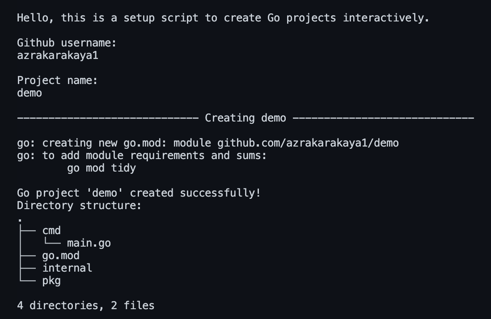

# Go Project Setup Script

## Description
This shell script helps you **create a new Go project interactively** with a standard directory structure and initialized Go module.

It automatically:
- Prompts for your **GitHub username** and **project name**
- Creates standard Go folders (`cmd`, `internal`, `pkg`)
- Initializes a `go.mod` file with your GitHub path
- Adds a sample `main.go` file
- Generates a `.gitignore` file
- Displays the created directory structure in the terminal

---

## Usage

### 1. Make the script executable
```bash
chmod +x golang_project_creator.sh


### 2. Run the script
```bash
./golang_project_creator.sh


### 3. Follow the promts
You will be asked for:
* Your GitHub username
* Your project name


#### Example Output



---

## Project Structure

After running the script, your Go project will have the following structure:

project_name/
├── cmd/
├── internal/
├── pkg/
├── go.mod
└── .gitignore


- **cmd/** – Contains the entry point(s) of your application. For example, `cmd/main.go` is where the `main()` function lives.  
- **internal/** – Packages in this folder are **private to the project** and cannot be imported from other projects. Use it for core application logic.  
- **pkg/** – Contains libraries or packages that can be shared and imported by other projects.  
- **go.mod** – The Go module file, which defines the module path and tracks dependencies.  
- **.gitignore** – Lists files and folders that Git should ignore (e.g., `bin/`, `vendor/`, temporary files).

This structure follows common Go project conventions, making your project organized and maintainable.

---

## Error Handling

* If the username or project name is empty → the script exits safely.
* If a directory with the same project name already exists → the script stops to prevent overwriting.
* Uses set -e to automatically stop on unexpected errors and avoid partial setup.
* Prints clear error messages before exiting with exit 1.
